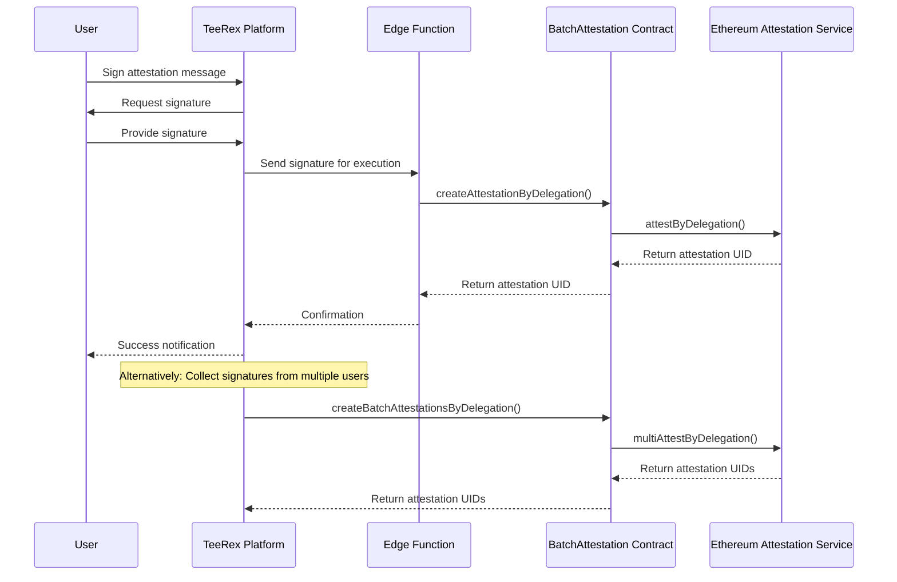

# Batch Attestation Integration Guide

**Version**: 1.2.0  
**Date**: October 19, 2025  
**Status**: Draft

## Overview

This document outlines the plan for integrating the `BatchAttestation` smart contract into the TeeRex platform. The contract provides a gas-efficient way to create multiple attestations in a single transaction and implements a signature-based delegation system for attestations.

### Key Benefits

- **Gas Efficiency**: Create multiple attestations in a single transaction
- **Delegation**: Users sign messages off-chain, admin executes on-chain
- **Token-Gating**: Integration with Unlock Protocol for access control
- **Security**: Role-based permissions for different operations
- **Service Execution**: Users only sign messages, service wallet pays gas

## Contract Details

- **Name**: BatchAttestation
- **Purpose**: Token-gated batch attestation contract for event management
- **Dependencies**:
  - Ethereum Attestation Service (EAS)
  - Unlock Protocol

## Integration Roadmap

### Phase 1: Initial Setup & Testing (Current Phase)

1. Deploy contract to test environment
2. Create basic integration hooks
3. Implement test UI in AdminEvents.tsx
4. Validate functionality with actual EAS attestations
5. Add edge function for single attestation delegation (implemented)

### Phase 2: Full Integration

1. Refine hooks based on testing feedback
2. Extend integration to user-facing components
3. Add attestation batching to event management flows
4. Implement signature collection for attendees
5. Integrate single attestation delegation into user flows (ongoing)

### Phase 3: Production Deployment

1. Deploy contract to mainnet
2. Set up monitoring and alerting
3. Update documentation for operators
4. Train support team on new flows

## Technical Implementation

### 1. Contract Deployment

The contract should be deployed to both Base Sepolia (testnet) and Base Mainnet with the following parameters:

```javascript
constructor(address _eas, address _initialOwner) {
    if (_eas == address(0)) revert InvalidEASAddress();
    eas = IEAS(_eas);
    _transferOwnership(_initialOwner);
}
```

- `_eas`: The Ethereum Attestation Service contract address
  - Base Sepolia: `0x4200000000000000000000000000000000000021`
  - Base Mainnet: `0x4200000000000000000000000000000000000021`
- `_initialOwner`: The TeeRex admin wallet address

After deployment, store contract addresses in environment variables:

- `VITE_TEEREX_ADDRESS_BASE_MAINNET`
- `VITE_TEEREX_ADDRESS_BASE_SEPOLIA`

### 2. Initial Contract Configuration

After deployment, the following configuration steps are required:

1. Set the creator lock address: `setCreatorLock(creatorLockAddress)`
2. Set the admin lock address: `setAdminLock(adminLockAddress)`
3. Enable required schemas: `setSchemaEnabled(schemaUID, true)`
4. Register existing event locks: `registerEventLock(lockAddress)`

### 3. Contract ABI File

Create the ABI file at `src/lib/abi/teerex-abi.ts` containing the full contract ABI. This file will be used by the hooks to interact with the contract.

Also create `supabase/functions/_shared/abi/BatchAttestationABI.json` for use in edge functions.

### 4. Contract Configuration Module

Create a configuration module at `src/lib/config/contract-config.ts` to handle contract addresses based on chain ID:

```typescript
export const getBatchAttestationAddress = (chainId: number): string => {
  if (chainId === 8453) {
    // Base Mainnet
    return import.meta.env.VITE_TEEREX_ADDRESS_BASE_MAINNET || "";
  } else if (chainId === 84532) {
    // Base Sepolia
    return import.meta.env.VITE_TEEREX_ADDRESS_BASE_SEPOLIA || "";
  }
  throw new Error(
    `Chain ID ${chainId} not supported for BatchAttestation contract`
  );
};
```

### 5. Contract Interaction Hooks

Implement React hooks at `src/hooks/useBatchAttestation.ts` for interacting with the contract:

```typescript
export const useBatchAttestation = (chainId: number) => {
  // Implementation details

  return {
    // Contract info
    contractAddress,
    chainId,
    isLoading,

    // Write functions
    registerEventLock,
    setSchemaEnabled,
    setCreatorLock,
    setAdminLock,
    setMaxBatchSize,
    createBatchAttestations,
    createSingleAttestation,

    // NEW: Edge function for service-executed attestations
    executeAttestation,

    // Read functions
    isSchemaEnabled,
    hasValidKeyForEvent,
    getKeyExpiration,
    isEventLock,
    getMaxBatchSize,
    getCreatorLock,
    getAdminLock,

    // Signature helpers
    signAttestationMessage,
  };
};
```

### 6. Data Encoding Utilities

Create utilities for encoding attestation data:

```typescript
export const useAttestationEncoding = () => {
  const encodeEventAttendanceData = (
    eventId: string,
    lockAddress: string,
    eventTitle: string,
    timestamp: number = Math.floor(Date.now() / 1000),
    location: string = "Metaverse"
  ): string => {
    // Implementation details
  };

  // Additional encoding functions

  return {
    encodeEventAttendanceData,
    // Other encoders
  };
};
```

### 7. Edge Function for Single Attestation Delegation

Create a new edge function at `supabase/functions/execute-attestation-delegation/index.ts` that allows users to sign messages and have the service wallet execute the attestation on their behalf:

```typescript
// supabase/functions/execute-attestation-delegation/index.ts
import { serve } from "https://deno.land/std@0.224.0/http/server.ts";
import { ethers } from "https://esm.sh/ethers@6.14.4";
import { createClient } from "https://esm.sh/@supabase/supabase-js@2.50.0";
import BatchAttestationABI from "../_shared/abi/BatchAttestationABI.json" assert { type: "json" };

// Function implementation that:
// 1. Authenticates the user via Privy
// 2. Validates the signature
// 3. Uses service wallet to call createAttestationByDelegation
// 4. Returns success/failure and transaction details
```

This function follows the same security and execution pattern as existing edge functions like `paystack-webhook` and `grant-keys-service`.

## Message Signing Flow

The key innovation in this integration is the use of off-chain signatures for attestation delegation:

1. **User Signs Message**: The user signs an EIP-712 typed data structure containing:

   - Schema UID
   - Recipient address
   - Attestation data
   - Signature deadline

2. **Platform Action**:

   - **Single Attestation**: User signature is immediately sent to edge function for execution by service wallet
   - **Batch Attestation**: Platform collects signatures from multiple users for later batch execution

3. **Execution**:
   - **Single**: Edge function executes via service wallet immediately
   - **Batch**: Admin executes the batch attestation with all collected signatures



## Test UI in AdminEvents.tsx

As a first step, we will implement a test UI in the AdminEvents page:

1. **Input Fields**:

   - BatchAttestation Contract Address
   - Schema UID
   - Recipient Address

2. **Actions**:

   - Sign Attestation Message
   - Execute Batch Attestation
   - Execute Single Attestation via Edge Function

3. **Display**:
   - List of signed messages
   - Attestation results
   - Single attestation results

### Single Attestation Test UI (Implemented)

Add a dedicated card for testing the single attestation delegation:

```tsx
<Card className="border-0 shadow-lg mt-6">
  <CardHeader>
    <CardTitle className="flex items-center gap-2">
      <Zap className="h-5 w-5" />
      Single Attestation via Edge Function
    </CardTitle>
    <CardDescription>
      Test single attestation using service wallet execution
    </CardDescription>
  </CardHeader>
  <CardContent>
    {/* Form fields and execution button */}
    {/* Result display */}
  </CardContent>
</Card>
```

## Potential Challenges and Solutions

| Challenge                                   | Solution                                                 |
| ------------------------------------------- | -------------------------------------------------------- |
| Gas costs for large batches                 | Implement proper batch size limits (max 50)              |
| User education on signatures                | Provide clear UI guidance and tooltips                   |
| Network switching                           | Auto-detect and prompt for correct network               |
| Signature verification                      | Implement client-side validation before submission       |
| Contract permissions                        | Clearly document lock requirements for actions           |
| Users attestation storage for batch sending | Use immutable records to prevent admin modifications     |
| Edge function rate limiting                 | Implement proper throttling for single attestation calls |
| Service wallet gas management               | Monitor balance and implement alerts                     |

## Integration with Existing Code

The batch attestation functionality is integrated with the existing attestation system and is additive (does not remove or break the polling-based flows):

1. Update `useAttestations.ts` to add signature-based methods
2. Add batch processing capabilities to admin interfaces
3. Extend `EventAttestationCard` to support signature collection (future extension)
4. Update `getEventAttestations` to handle batch-created attestations
5. Add SSE endpoints and admin UI tester for live progress
6. Add client methods to call the single attestation delegation edge function (implemented)

### What's Implemented in App (Exact)

- Delegation persistence table: `public.attestation_delegations` (immutable inserts; service role updates execution status)
- Edge Functions:
  - `execute-batch-attestations`: Executes pending delegations in batch; supports JSON and SSE modes; parses EAS `Attested` UIDs from logs and writes `attestations` rows.
  - `sse-batch`: Streams per-event batch progress (pending/executed and newly executed slices).
  - `sse-transaction-status`: Streams Paystack verification status per `reference`.
  - `attest-by-delegation`: Execute a single EAS attestation by delegation via service wallet and the BatchAttestation contract.
- Client hooks:
  - `useBatchAttestation(chainId)`: Sign (EIP-712) + read/write helpers to the BatchAttestation contract.
  - `useAttestationEncoding()`: Encoders that match EAS SchemaEncoder field types.
  - `useSSE()`: Reusable EventSource wrapper with auto-reconnect and Last-Event-ID support.
- Admin UI tester (Admin → Events):
  - Live SSE block to start/stop batch stream and transaction status stream.
  - "Execute via SSE" to run batch execution and watch granular progress.
  - **NEW**: Single attestation delegation test UI

### Persistence of Delegations (Batch Path)

Table: `public.attestation_delegations`

- Columns: `id, event_id, schema_uid, recipient, data (0x…), deadline (ts), signer_address, signature, message_hash (unique), lock_address, event_title, executed, executed_tx_hash, executed_at, created_at`
- RLS: allow `SELECT`/`INSERT` for clients; no `UPDATE`/`DELETE`. Edge Functions (service role) mark `executed` and write results to `attestations`.

### Single Attestation Edge Function (Exact)

- Endpoint: `POST /functions/v1/attest-by-delegation`
- Auth: Requires `X-Privy-Authorization: Bearer <token>` (verified via JWKS with local fallback)
- Body:
  - `eventId?` (UUID) — when provided, unlock key gating is enforced for the `recipient`
  - `chainId?` — defaults to Base Sepolia (84532) if omitted
  - `contractAddress?` — BatchAttestation contract (falls back to `TEEREX_ADDRESS_BASE_*`)
  - `schemaUid` (bytes32)
  - `recipient` (address)
  - `data` (0x — EAS-encoded bytes)
  - `deadline` (uint seconds)
  - `signature` (0x rsv — EIP‑712 delegated typed data)
  - `lockAddress?`, `expirationTime?`, `revocable?`, `refUID?` (optional, sensible defaults)
- Verification:
  - Rebuilds EIP‑712 delegated typed data for EAS domain and recovers signer with `ethers.verifyTypedData`.
  - Fetches all linked wallets for the authenticated Privy user using shared helper `getUserWalletAddresses` (`supabase/functions/_shared/privy.ts`).
  - Requires recovered signer ∈ user wallets AND recovered signer == `recipient`.
  - If `eventId` and a lock are available, checks `getHasValidKey(recipient)` before submitting.
- Execution:
  - Uses service wallet (UNLOCK_SERVICE_PRIVATE_KEY) to call `BatchAttestation.createAttestationByDelegation(lockAddress, schemaUID, recipient, data, {v,r,s}, attester=recipient, deadline, expirationTime, revocable, refUID)`.
  - Parses Attested logs to extract the exact EAS UID, inserts an `attestations` row (best effort), and returns `{ ok, txHash, uid }`.

Benefits:
- Users pay no gas (service wallet executes)
- Immediate, single attestation (no batch wait)
- Strong identity binding to the authenticated Privy user and declared recipient

### Attestation UID Extraction

Both edge functions parse on-chain logs to extract exact EAS UIDs using:

```
event Attested(address indexed recipient, address indexed attester, bytes32 uid, bytes32 indexed schema)
```

- If parsing fails (signature variant mismatch), it falls back to storing `message_hash` in `attestation_uid` so the UI remains functional.

### Contract Gating (Updated)

- The contract now gates delegated attestation APIs by creator lock instead of event ticket ownership:
  - `createBatchAttestationsByDelegation` — `onlyCreators()` modifier
  - `createAttestationByDelegation` — `onlyCreators()` modifier
- Ensure the service wallet (and/or designated operators) holds a key to `creatorLock` via `setCreatorLock`.

### Client Hooks (Exact)

- `useDelegatedAttestation`
  - Signs EAS delegated typed data in the browser and returns `{ signature, deadline, attester }` (attester is the user’s address).
  - Domain: `{ name: 'EAS', version: '1.0.0', chainId, verifyingContract: 0x420…21 }`
- `useAttestationEncoding`
  - Encodes event attendance data in the same field order the app expects.
- `useSSE`
  - Wrapper around EventSource with auto-reconnect and Last-Event-ID awareness.

### SSE Endpoints (Additive, Exact)

- `sse-batch` — streams batch delegation progress by `eventId`.
- `sse-transaction-status` — streams Paystack verification by `reference`.
- `sse-single-attestation` — streams the appearance of a single `attestations` row by `eventId`, `recipient`, and `schemaUid`.

All three provide heartbeats and retry behaviors; are additive to existing polling.

### Admin UI Test Panel (Exact)

- Admin → Events → "Batch Attestations (Test)"
  - Single Attestation:
    - Sign EAS delegated data, then call `attest-by-delegation`.
    - Start Single Stream: `/functions/v1/sse-single-attestation?eventId=…&recipient=…&schemaUid=…` to watch for success.
  - Batch Streams: start/stop `sse-batch`; payments stream via `sse-transaction-status`.
  - Execute Batch via SSE: runs `execute-batch-attestations` with streaming progress.

### Shared Utilities

- `supabase/functions/_shared/privy.ts`: `getUserWalletAddresses(privyUserId)` — returns all wallet addresses linked to a Privy user; used to bind signatures to user identity.
- `supabase/functions/_shared/cors.ts`: CORS helpers and preflight.

### Environment Variables (Exact)

- Server (Edge Functions):
  - `SUPABASE_URL`, `SUPABASE_SERVICE_ROLE_KEY`
  - `UNLOCK_SERVICE_PRIVATE_KEY`
  - `PRIVY_APP_ID`, `PRIVY_APP_SECRET`, optional `PRIVY_VERIFICATION_KEY`
  - Optional: `PRIMARY_RPC_URL`, `TEEREX_ADDRESS_BASE_SEPOLIA`, `TEEREX_ADDRESS_BASE_MAINNET`
- Client:
  - `VITE_SUPABASE_URL`
  - `VITE_TEEREX_ADDRESS_BASE_SEPOLIA` / `VITE_TEEREX_ADDRESS_BASE_MAINNET`

### Execution Modes

- JSON mode (existing): `POST /functions/v1/execute-batch-attestations` with `{ eventId, chainId, contractAddress }` → `{ ok, txHash, count }`.
- SSE mode (additive): `GET /functions/v1/execute-batch-attestations?sse=1&eventId=...&chainId=...&contractAddress=...`
- **NEW**: Single attestation delegation: `POST /functions/v1/execute-attestation-delegation` with signature data → `{ success, attestationUID, transactionHash }`

### SSE Endpoints (Additive)

- `sse-batch` (Edge Function)

  - Streams batch delegation progress per `eventId`.
  - URL: `/functions/v1/sse-batch?eventId=<uuid>&timeoutMs=120000`
  - Events:
    - `stats`: `{ pending, executed, latestExecutedAt }`
    - `executed`: `[{ id, recipient, schema_uid, executed_at, executed_tx_hash }]`
    - `end`: when timeout or complete
  - Sends `retry: 2000` and heartbeats (`: keep-alive`) every 15s; honors `Last-Event-ID`.

- `sse-transaction-status` (Edge Function)
  - Streams payment transaction verification per `reference`.
  - URL: `/functions/v1/sse-transaction-status?reference=<ref>&timeoutMs=120000`
  - Events:
    - `status`: `{ reference, status, keyGranted, updatedAt, verifiedAt }`
    - `end`: when success+keyGranted observed
  - Sends `retry: 2000` and heartbeats; honors `Last-Event-ID`.

### Admin UI Test Panel

- Navigate to Admin → Events → "Batch Attestations (Test)" card.
  - Start Batch Stream: subscribes to `sse-batch` for the selected event.
  - Start TX Stream: subscribes to `sse-transaction-status` for a given Paystack `reference`.
  - Execute via SSE: triggers `execute-batch-attestations` in streaming mode and logs detailed progress.
- **NEW**: "Single Attestation via Edge Function" card
  - Input fields for attestation parameters
  - Execute button that calls the edge function
  - Result display showing transaction details

### Multi-Consumer Behavior

- Any number of clients can subscribe to the same batch (`eventId`) or transaction (`reference`) stream simultaneously; each receives identical updates.
- The execution endpoint should only be called by privileged operators to avoid duplicate sends. Observers can watch via the batch SSE endpoint.

### Security & Access Control

- Streams expose non-sensitive status already accessible via polling; they are currently public (CORS open) for simplicity.
- **NEW**: The single attestation delegation function requires user authentication via Privy token.
- Recommended hardening (next step):
  - Require wallet-based authorization for executing batches (e.g., caller must hold admin lock; verify via Unlock in the function).
  - Optional signed token to authorize streaming execution progress.
  - Add an execution lock/state transition to prevent concurrent double-submission.
  - Rate limiting for the single attestation edge function to prevent abuse.

### Environment Variables

- Client:
  - `VITE_SUPABASE_URL`
  - `VITE_TEEREX_ADDRESS_BASE_SEPOLIA` / `VITE_TEEREX_ADDRESS_BASE_MAINNET`
- Server (Edge Functions):
  - `SUPABASE_URL`, `SUPABASE_SERVICE_ROLE_KEY`
  - `UNLOCK_SERVICE_PRIVATE_KEY` (service wallet)
  - Optional `RPC_URL`
  - Optional `TEEREX_ADDRESS_BASE_SEPOLIA` / `TEEREX_ADDRESS_BASE_MAINNET`

### Additive Design

- All SSE features are additive; existing polling APIs and UI remain intact.
- Admin Events page provides test interfaces to validate SSE without impacting current flows.
- **NEW**: Single attestation delegation enhances, but doesn't replace, existing attestation methods.

## Deployment Strategy

1. **Testnet Deployment**:

   - Deploy to Base Sepolia
   - Configure with test locks
   - Validate with test schemas
   - Run complete flow with test users
   - **NEW**: Test single attestation delegation with various schema types

2. **Mainnet Deployment**:
   - Deploy with same parameters as testnet
   - Configure production locks
   - Enable production schemas
   - Gradual rollout to users

## Monitoring and Maintenance

1. **Event Monitoring**:

   - Track `BatchAttestationCreated` events
   - Monitor failed transactions
   - Alert on unusual activity
   - **NEW**: Track service wallet gas usage from attestation delegations

2. **Health Checks**:
   - Regular verification of lock statuses
   - Schema validation
   - User permission checks
   - **NEW**: Monitor edge function performance and error rates

## Testing Plan

1. **Unit Tests**:

   - Hook function tests
   - Signature generation and validation
   - Data encoding functions
   - **NEW**: Edge function parameter validation

2. **Integration Tests**:

   - End-to-end flow with Metamask
   - Multi-user signature collection
   - Batch execution with varying sizes
   - **NEW**: Single attestation delegation with service wallet

3. **Performance Tests**:
   - Gas usage for different batch sizes
   - Signature collection with high volume
   - UI responsiveness with many signatures
   - **NEW**: Edge function response times under load

## Future Enhancements

1. Automated batch execution on schedule
2. UI for users to view their signed attestations
3. Notification system for successful attestations
4. Integration with event check-in process
5. Mobile-optimized signature collection
6. **NEW**: WebSocket-based real-time feedback for single attestation execution
7. **NEW**: Parallel processing for high-volume attestation requests

## Conclusion

The BatchAttestation contract integration provides a more efficient and user-friendly way to create attestations in the TeeRex platform. By using signature delegation, we can significantly improve the user experience while reducing gas costs and blockchain interactions.

The addition of the single attestation delegation edge function further enhances this approach by providing immediate execution without requiring users to pay gas fees. This creates a seamless experience where users simply sign messages and the platform handles the blockchain interactions.

The phased approach allows for thorough testing and validation before full production deployment, ensuring a smooth transition for users and administrators.

---

## Appendix: Contract Function Reference

### Write Functions

- `registerEventLock(address lockAddress)`: Register a lock address as an event lock
- `setSchemaEnabled(bytes32 schemaUID, bool enabled)`: Enable or disable a schema
- `setCreatorLock(address lockAddress)`: Set the creator lock address
- `setAdminLock(address lockAddress)`: Set the admin lock address
- `setMaxBatchSize(uint256 newMaxSize)`: Update maximum batch size
- `createBatchAttestationsByDelegation(...)`: Create batch attestations using delegation
- `createAttestationByDelegation(...)`: Create a single attestation using delegation
- `pause()`: Emergency pause function
- `unpause()`: Unpause function

### Read Functions

- `isSchemaEnabled(bytes32 schemaUID)`: Check if a schema is enabled
- `hasValidKeyForEvent(address lockAddress, address keyHolder)`: Check if an address has a valid key
- `getKeyExpiration(address lockAddress, address keyHolder)`: Get key expiration timestamp
- `isEventLock(address)`: Check if a lock is registered as an event lock
- `maxBatchSize()`: Get the maximum batch size
- `creatorLock()`: Get the creator lock address
- `adminLock()`: Get the admin lock address

### Access Control

- `onlyAdmin()`: Requires caller to be owner or have admin lock key
- `onlyKeyHolder(address lockAddress)`: Requires caller to have a valid key for the event
- `validSchema(bytes32 schemaUID)`: Requires schema to be enabled
- `onlyCreators()`: Requires caller to have a valid key for the creator lock
